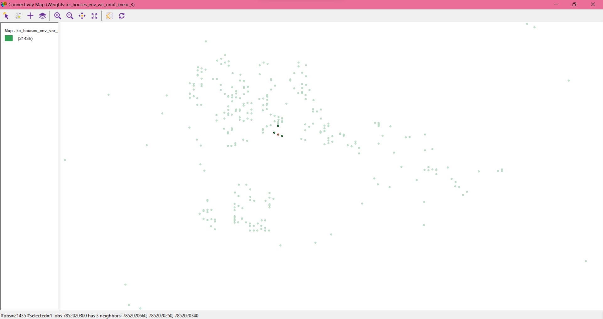
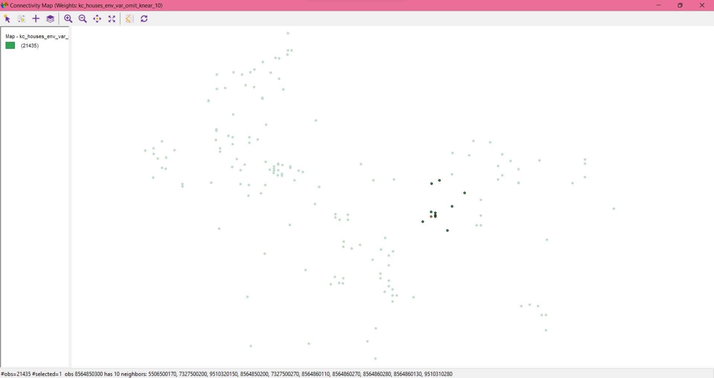

```{r setup, echo=FALSE, message=FALSE}
library(tidyverse)
library(dplyr)
library(huxtable)
library(lubridate)
library(sf)
library(here)
library(tmap)
library(sp)
library(spdep)
library(spatialreg)
library(lmtest)
library(sandwich)
library(units)
library(car)
library(foreign)
library(readr)
library(lubridate)
options(scipen = 999)
```


\newpage 
\tableofcontents 

\newpage

# 1. Review of papers

*Her kommer det noe tekst*


# 2. House Sales in King County, WA

```{r}
kc_house_data <- read_csv("data/kc_house_data.csv")
attach(kc_house_data)
```

```{r}
kc_house_data <- arrange(kc_house_data, desc(date))
```

```{r}
kc_house_data <- kc_house_data %>%
    distinct(id, .keep_all = TRUE)
```

```{r}
kc_house_data_sf <- st_as_sf(kc_house_data,
             coords = c(x = "long", y = "lat"),
             crs = 4326) %>% 
    st_transform(2926)
```

Koordinater Seattle: 47.60621, -122.33207

```{r}
cbd <- st_sfc(st_point(c(-122.33207, 47.60621)), crs = 4326) %>% 
    st_transform(2926)
cbd
```

```{r}
kc_house_data_sf <-  kc_house_data_sf %>% 
  mutate(
    dist_cbd = st_distance(cbd, ., by_element = TRUE),
    dist_cbd_km = set_units(dist_cbd, km)
  )
```


# 3. Family income

```{r}
kc_wadoh_map <- here("maps/WADOH_Environmental_Health_Disparities_Index_Calculated_for_King_County___wadohehdindex_area/WADOH_Environmental_Health_Disparities_Index_Calculated_for_King_County___wadohehdindex_area.shp") %>% 
      st_read() %>% 
  st_transform(2926)
```

```{r}
kc_wadoh_map <- kc_wadoh_map %>% 
  select(
  GEO_ID_TRT,
  EHD_percen,#Environmental Health Index, weighted score many vars
  linguist_2,#Pop. age 5+ speaking English less than "very well"
  poverty_pe,#Percentage people living in poverty
  POC_percen,#People of Color in percentage of pop. in tract
  transporta,#% of income spent on transportation median family in tract
  unemploy_2,#percentage unemployed
  housing_pe,#% of households in group "Unaffordable Housing" (>30% inc.)
  traffic_pe,#% of pop. near heavy traffic roadways
  diesel,# nox consentration
  ozone,# ozone consentration
  PM25, # consentration of Particulate Matter in air
  toxic_rele, # Toxic release from factories
  hazardous_, # Hazardous Waste Treatment Storage and disposal Facilities
  lead_perce, # measure of Lead paint in houses
  superfund, # Proximity to contaminated sites on national list
  facilities, # Proximity to Risk Management Plan Facilities
  wastewater, # Proximity to wastewater facilities
  sen_pop_pe, # % pop. over 65
  socio_perc # score social economic determants, low best
  )
```

```{r}
class(kc_wadoh_map)
```


```{r}
asc_b19101_fam_inc <- read.dbf("maps/censusSHP/acs_b19101_familyincome.dbf")
attach(asc_b19101_fam_inc)
```

```{r}
asc_b19101_fam_inc <- asc_b19101_fam_inc %>% 
    mutate(low = (E19101138 + E19101139 + E19101140 + E19101141 + E19101142 + E19101143)) %>% 
    mutate(mid = (E19101144 + E19101145 + E19101146 + E19101147 + E19101148 + E19101149)) %>% 
    mutate(high = (E19101150 + E19101151 + E19101152 + E19101153))
```

```{r}
asc_b19101_fam_inc <- asc_b19101_fam_inc %>% 
    select(GEOIDTRT, low, mid, high) %>% 
    rename(GEO_ID_TRT = GEOIDTRT)
```

```{r}
kc_wadoh_map_2 <- left_join(
    asc_b19101_fam_inc,
    st_drop_geometry(kc_wadoh_map),
    by = "GEO_ID_TRT")
```

```{r}
class(kc_wadoh_map_2)
```


```{r}
kc_tracts10 <- here("maps/censusSHP/tracts10.shp") %>% 
  st_read() %>% 
  st_transform(2926)
```

```{r}
kc_tracts10_shore <- here("maps/censusSHP/tracts10_shore.shp") %>% 
  st_read() %>% 
  st_transform(2926)
```

```{r}
kc_tracts10_env_data <- left_join(
  kc_tracts10, kc_wadoh_map_2,
  by = "GEO_ID_TRT"
  )

kc_tracts10_shore_env_data <- left_join(
  kc_tracts10_shore, kc_wadoh_map_2,
  by = "GEO_ID_TRT"
  )
```

```{r}
class(kc_tracts10_env_data)
class(kc_tracts10_shore_env_data)
```

```{r}
summary(kc_tracts10)
```

```{r}
kc_houses_env_var <- st_join(kc_house_data_sf, kc_tracts10_env_data)
kc_tracts10_shore_env_var <- st_join(kc_house_data_sf, kc_tracts10_shore_env_data)
```

```{r}
st_write(kc_house_data, "maps/kc_house_data.gpkg", append = FALSE)
st_write(kc_tracts10, "maps/kc_tracts10.gpkg", append = FALSE)
st_write(kc_tracts10_shore, "maps/kc_tracts10_shore.gpkg", append = FALSE)
st_write(kc_houses_env_var, "maps/kc_houses_env_var.gpkg", append = FALSE)
st_write(kc_tracts10_shore_env_var, "maps/kc_tracts10_shore_env_var.gpkg", append = FALSE)
```

# 4. 

```{r}
summary(kc_tracts10_env_data)
```


```{r}
summary(kc_tracts10_shore_env_var)
```

Ved å se på dataene sammen med kartene i QGIS, så ser vi at *kc__tracts10_env_data* har én observasjons som faller utenfor kommunegrensene.


Ved å studere *kc_tracts10_shore_env_data* ser vi at alle observasjonene ligger fortsatt innenfor kommunegrensene, men ved å legge til shore-kartet som viser vannlinjen ser vi at det er 25 observasjoner som ligger utenfor denne vannlinen, og derfor gir 25 NA.


```{r}
kc_houses_env_var <- arrange(kc_houses_env_var, desc(id))
kc_houses_env_var_omit <- kc_houses_env_var[-c(11997),]
```

```{r}
st_write(kc_houses_env_var_omit, "maps/kc_houses_env_var_omit.gpkg", append = FALSE)
```

```{r}
kc_houses_env_var_omit <- kc_houses_env_var_omit %>% 
    mutate(
        year_month = substr(date, start = 1, stop = 7))

# Alternativ måte, som ikke tar med "0" i mnd:
#     mutate(year_month = paste(year(date), month(date), sep = "-"))
```

```{r}
st_write(kc_houses_env_var_omit, "maps/kc_houses_env_var_omit.gpkg", append = FALSE)
```

# 5. Geoda-analyser

## 3 nærmeste naboer



### Små og dyre boliger


### Store og dyre boliger


### Store og billige boliger


### Små og billige boliger


## Nærmeste 10 naboer



### Små og dyre boliger


### Store og dyre boliger


### Store og billige boliger


### Små og billige boliger


